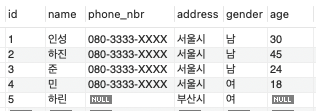
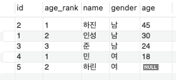
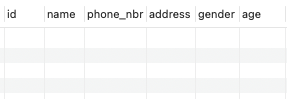

## DDL
```sql
-- 테이블 생성
CREATE TABLE address (
    id SERIAL PRIMARY KEY,
    name VARCHAR(40),
    phone_nbr VARCHAR(20),
    address VARCHAR(255),
    gender VARCHAR(20),
    age INT
);

-- 테이블 삭제
drop table address
```

## DML
```sql
-- 더미데이터 생성
INSERT INTO address (name, phone_nbr, address, gender, age) VALUES
('인성', '080-3333-XXXX', '서울시', '남', 30),
('하진', '080-3333-XXXX', '서울시', '남', 45),
('준', '080-3333-XXXX', '서울시', '남', 24),
('민', '080-3333-XXXX', '서울시', '여', 18),
('하린', null, '부산시', '여', null);

-- 데이터 조회
select * from address;
```
### 결과


## 실습쿼리 1
```sql
-- 104p 연습문제 1
select id, DENSE_RANK() OVER (partition by gender order by age DESC) as age_rank, name, gender, age
from address;
```
### 결과


### 실행계획
```mysql
-> Window aggregate: dense_rank() OVER (PARTITION BY address.gender ORDER BY address.age desc )   (cost=0 rows=5)
    -> Sort: address.gender, address.age DESC  (cost=0.75 rows=5)
        -> Table scan on address  (cost=0.75 rows=5)
```
1. address 테이블을 스캔하여 테이블의 모든 행을 읽어온다. 읽어온 행의 수는 5개이며 비용은 0.75이다.
2. 읽어온 데이터에 대한 정렬이 이루어진다. gender를 기준으로 오름차순 정렬하고, age를 기준으로 내림차순 정렬한다. 비용은 0.75이다.
3. dense_rank() 윈도우 함수를 이용하여 gender를 기준으로 파티션을 나누고, 각 파티션 별로 age를 기준으로 내림차순 정렬하여 순위를 매긴다. 순위에 중복값이 있을 경우 동일 순위를 부여한다. 비용은 0이다.

## 실습쿼리 2
```sql
-- 92p 차집합
explain format = Tree
select * from address
except 
select * from address;
```

### 결과


### 실행계획
```mysql
-> Table scan on <except temporary>  (cost=2.51..4.56 rows=5)
    -> Except materialize with deduplication  (cost=2..2 rows=5)
        -> Table scan on address  (cost=0.75 rows=5)
        -> Table scan on address  (cost=0.75 rows=5)
```
1. address 테이블을 스캔하여 테이블의 모든 행을 읽어온다. 읽어온 행의 수는 5개이며 비용은 0.75이다.
2. address 테이블을 스캔하여 테이블의 모든 행을 읽어온다. 읽어온 행의 수는 5개이며 비용은 0.75이다.
3. except 연산을 수행하기 위해 두 테이블의 데이터를 비교한다. 비용은 2이다.
4. except 연산의 결과로 생성된 임시 테이블을 스캔한다. 읽어온 행의 수는 5개이며 비용은 2.51에서 4.56이다.