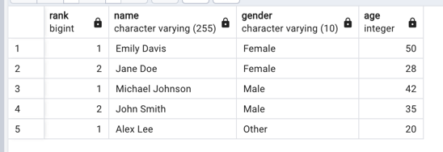
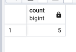
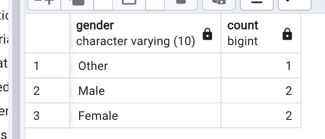

# 11week

## 실습1
### 성별을 기준으로 나이순으로 정렬하는 코드(실습 문제 104쪽)
```sql

-- Create the address table
CREATE TABLE Address (
    ID SERIAL PRIMARY KEY,
    Name VARCHAR(255),
    PhoneNumber VARCHAR(20),
    Address VARCHAR(255),
    Gender VARCHAR(10),
    Age INT
);

-- Insert sample data into the address table
INSERT INTO Address (Name, PhoneNumber, Address, Gender, Age) VALUES
('John Smith', '123-456-7890', '123 Main St', 'Male', 35),
('Jane Doe', '987-654-3210', '456 Elm St', 'Female', 28),
('Michael Johnson', '555-123-4567', '789 Oak St', 'Male', 42),
('Emily Davis', '333-555-7777', '321 Pine St', 'Female', 50),
('Alex Lee', '111-222-3333', '555 Maple St', 'Other', 20);


select DENSE_RANK() OVER(partition by gender order by age DESC) as rank,name,gender,age
from address 

```

### 결과



## 실습 2
### 전체 인원수 구하기 
````sql
select count(*)
from address
group by();
````

### 성별별 인원수 구하기 
```sql
select gender, count(*)
from address
group by(gender);
```


