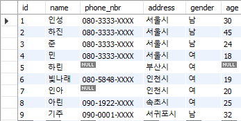
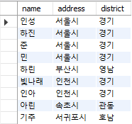
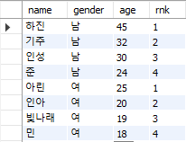

# 11week

## p.65~

### query
```sql
-- create table

CREATE TABLE address (
    id SERIAL PRIMARY KEY,
    name VARCHAR(40),
    phone_nbr VARCHAR(20),
    address VARCHAR(255),
    gender VARCHAR(20),
    age INT
);

-- insert values

INSERT INTO address (name, phone_nbr, address, gender, age) VALUES
('인성', '080-3333-XXXX', '서울시', '남', 30),
('하진', '080-3333-XXXX', '서울시', '남', 45),
('준', '080-3333-XXXX', '서울시', '남', 24),
('민', '080-3333-XXXX', '서울시', '여', 18),
('하린', null, '부산시', '여', null),
('빛나래', '080-5848-XXXX', '인천시', '여', 19),
('인아', null, '인천시', '여', 20),
('아린', '090-1922-XXXX', '속초시', '여', 25),
('기주', '090-0001-XXXX', '서귀포시', '남', 32);
```

### result


## p.83~

### query
```sql
--- create view

create view CountAddress (v_address, cnt)
as
select address, count(*)
    from address
  group by address;
```

### result


## p.89~

### query
```sql
--- case when then

select name, address,
	case when address = '서울시' then '경기'
		 when address = '인천시' then '경기'
         when address = '부산시' then '영남'
         when address = '속초시' then '관동'
         when address = '서귀포시' then '호남'
         else null end as district
from address;
```

### result


## 연습문제 - p.104

### query
```sql
--- MariaDB 10.0.38 버전으로 인해 RANK() 함수 사용 X
select 
    name,
    gender,
    age,
    (select count(*) + 1
     from address a2
     where a2.gender = a.gender and a2.age > a.age) as rnk
from address a
order by gender, age desc;

--- 사용 가능하다면
select name,
       gender,
       age,
       rank() over(partition by gender order by age desc) rnk
from address;
```

### result
