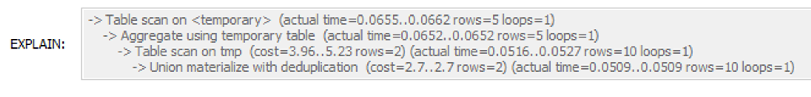
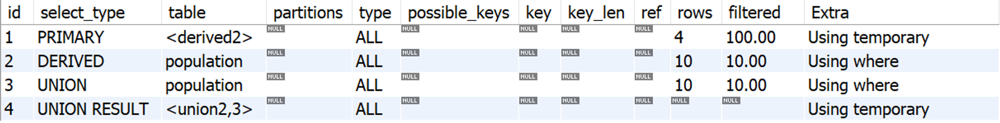
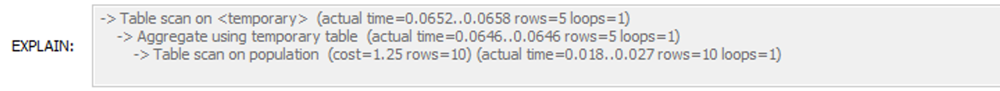
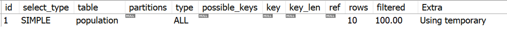
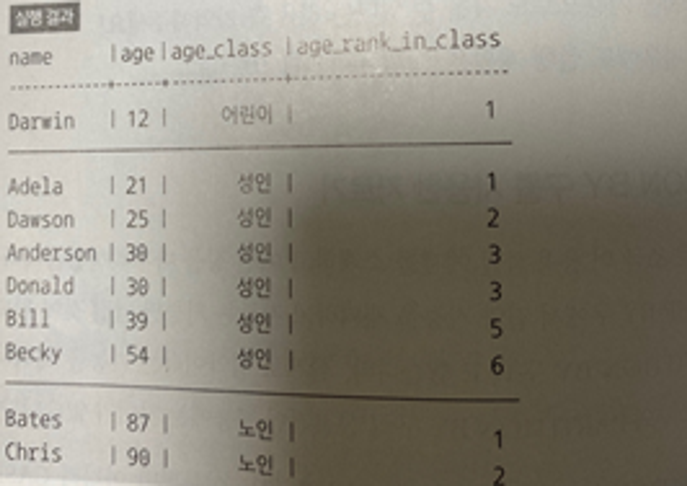

## 실습1

### 지역별 남녀 인구 기록 테이블 Population

```sql
CREATE TABLE Population (
	prefecture varchar(255),
    sex integer,
    pop integer
);
// 남성 1, 여성 2

INSERT INTO Population 
values ('성남', 1, 60),
('성남', 2, 40),
('수원', 1, 90),
('수원', 2, 100),
('광명', 1, 100),
('광명', 2, 500),
('일산', 1, 100),
('일산', 2, 100),
('용인', 1, 20),
('용인', 2, 200);

// UNION을 사용한 방식
SELECT prefecture, SUM(pop_men) AS pop_men, SUM(pop_wom) AS pop_wom
FROM (SELECT prefecture, pop AS pop_men, NULL AS pop_wom
    FROM population
    WHERE sex = 1
    UNION
    SELECT prefecture, NULL AS pop_men, pop AS pop_men
    FROM population
    WHERE sex = 2) tmp
GROUP BY prefecture;
```



```sql
// CASE 식 사용
SELECT prefecture,
SUM(CASE WHEN sex = 1 THEN pop ELSE 0 END) AS pop_men,
SUM(CASE WHEN sex = 2 THEN pop ELSE 0 END) AS pop_wom
FROM population
GROUP BY prefecture;
```





## 실습2

### PARTITION BY 구를 사용한 자르기

```sql
CREATE TABLE Persons (
	name VARCHAR(255),
	age INTEGER,
    height float,
    weight float
);

INSERT INTO Persons
VALUES 
('Anderson', 30, 188, 90),
('Adela', 21, 167, 55),
('Bates', 87, 158, 48),
('Becky', 54, 187, 70),
('Bill', 39, 177, 120),
('Chris', 90, 175, 48),
('Darwin', 12, 160, 55),
('Dawson', 25, 182, 90),
('Donald', 30, 176, 53);

SELECT name, age,
CASE WHEN age < 20 THEN '어린이'
    WHEN age BETWEEN 20 AND 69 THEN '성인'
    WHEN age >= 70 THEN '노인'
    ELSE NULL END as age_class,
RANK() OVER(PARTITION BY 
    CASE WHEN age < 20 THEN '어린이'
    WHEN age BETWEEN 20 AND 69 THEN '성인'
    WHEN age >= 70 THEN '노인'
    ELSE NULL END
    ORDER BY age) AS age_rank_in_class
FROM Persons
ORDER BY age_class DESC, age_rank_in_class;
```
