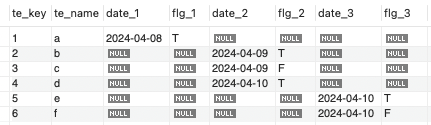
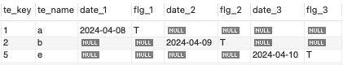
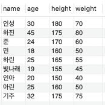
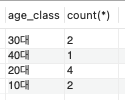
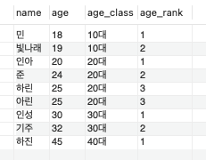

## UNION vs OR vs CASE WHEN 

### DDL
```mysql
-- 테이블 생성
create table ThreeElements
(
    te_key int,
    te_name varchar(10),
    date_1 date,
    flg_1 varchar(10),
    date_2 date,
    flg_2 varchar(10),
    date_3 date,
    flg_3 varchar(10)
);
```

### DML
```mysql
-- 더미데이터 생성
insert into ThreeElements 
(
	te_key,te_name, date_1,flg_1,date_2,flg_2,date_3,flg_3
)
values
	(1,'a','2024-04-08', 'T',null,null,null,null),
	(2,'b',null, null,'2024-04-09','T',null,null),
	(3,'c',null, null,'2024-04-09','F',null,null),
	(4,'d',null, null,'2024-04-10','T',null,null),
	(5,'e',null, null,null,null,'2024-04-10','T'),
	(6,'f',null, null,null,null,'2024-04-10','F');
```

### 결과


### Select 쿼리
```mysql
-- union 사용
select te_key, te_name, date_1, flg_1, date_2, flg_2, date_3, flg_3
from ThreeElements
where date_1 = '2024-04-08'
and flg_1 = 'T'

union

select te_key, te_name, date_1, flg_1, date_2, flg_2, date_3, flg_3
from ThreeElements
where date_2 = '2024-04-09'
and flg_2 = 'T'

union

select te_key, te_name, date_1, flg_1, date_2, flg_2, date_3, flg_3
from ThreeElements
where date_3 = '2024-04-10'
and flg_3 = 'T';
```

### 결과


### 실행계획
```mysql
-> Table scan on <union temporary>  (cost=3.7..5.39 rows=3)
    -> Union materialize with deduplication  (cost=2.85..2.85 rows=3)
        -> Filter: ((threeelements.flg_1 = 'T') and (threeelements.date_1 = DATE'2024-04-08'))  (cost=0.85 rows=1)
            -> Table scan on ThreeElements  (cost=0.85 rows=6)
        -> Filter: ((threeelements.flg_2 = 'T') and (threeelements.date_2 = DATE'2024-04-09'))  (cost=0.85 rows=1)
            -> Table scan on ThreeElements  (cost=0.85 rows=6)
        -> Filter: ((threeelements.flg_3 = 'T') and (threeelements.date_3 = DATE'2024-04-10'))  (cost=0.85 rows=1)
            -> Table scan on ThreeElements  (cost=0.85 rows=6)
```
- union을 사용한 경우, 각각의 select 쿼리를 수행하고 결과를 합치는 방식으로 수행된다.
- 각각의 select 쿼리는 각각의 테이블 스캔을 수행하고, 필터링을 통해 결과를 추출한다.

### OR을 사용하는 경우
```mysql
select te_key, te_name, date_1, flg_1, date_2, flg_2, date_3, flg_3
from ThreeElements
where (date_1 = '2024-04-08' and flg_1 = 'T')
or (date_2 = '2024-04-09' and flg_2 = 'T')
or (date_3 = '2024-04-10' and flg_3 = 'T');
```

### 실행계획
```mysql
-> Filter: (((threeelements.flg_1 = 'T') and (threeelements.date_1 = DATE'2024-04-08')) or ((threeelements.flg_2 = 'T') and (threeelements.date_2 = DATE'2024-04-09')) or ((threeelements.flg_3 = 'T') and (threeelements.date_3 = DATE'2024-04-10')))  (cost=0.85 rows=1)
    -> Table scan on ThreeElements  (cost=0.85 rows=6)
```
- union을 사용한 경우보다 실행계획이 간단하다.
- 테이블에 대한 스캔이 한 번만 일어난다.

### CASE WHEN을 사용하는 경우
```mysql
select te_key, te_name, date_1, flg_1, date_2, flg_2, date_3, flg_3
from ThreeElements
where case
    when date_1 = '2024-04-08' and flg_1 = 'T' then 1
    when date_2 = '2024-04-09' and flg_2 = 'T' then 1
    when date_3 = '2024-04-10' and flg_3 = 'T' then 1
    else 0
end = 1;
```

### 실행계획
```mysql
-> Filter: ((case when ((threeelements.date_1 = DATE'2024-04-08') and (threeelements.flg_1 = 'T')) then 1 when ((threeelements.date_2 = DATE'2024-04-09') and (threeelements.flg_2 = 'T')) then 1 when ((threeelements.date_3 = DATE'2024-04-10') and (threeelements.flg_3 = 'T')) then 1 else 0 end) = 1)  (cost=0.85 rows=6)
    -> Table scan on ThreeElements  (cost=0.85 rows=6)
```
- CASE WHEN을 사용한 경우, OR을 사용한 경우와 동일한 실행계획을 가진다.
- 하지만 CASE를 사용하는 경우 비즈니스 로직을 조금만 변경해도 OR과 다른 결과가 나올 수 있다.

## 자르기

### DDL
```mysql
-- 테이블 생성
create table Persons
(
    name varchar(40),
    age int,
    height int,
    weight int
);
```

### DML
```mysql
-- 더미데이터 생성
insert into Persons
(
    name, age, height, weight
)
values
    ('인성', 30, 180, 70),
    ('하진', 45, 175, 80),
    ('준', 24, 170, 60),
    ('민', 18, 160, 50),
    ('하린', 25, 165, 55),
    ('빛나래', 19, 155, 45),
    ('인아', 20, 150, 40),
    ('아린', 25, 160, 50),
    ('기주', 32, 175, 75);
```

### 결과


### Group By + Case When
```mysql
select 
    case
        when age < 20 then '10대'
        when age < 30 then '20대'
        when age < 40 then '30대'
        when age < 50 then '40대'
        else '50대 이상'
    end as age_class,
    count(*)
from Persons
group by CASE WHEN age < 20 THEN '10대'
              WHEN age < 30 THEN '20대'
              WHEN age < 40 THEN '30대'
              WHEN age < 50 THEN '40대'
              ELSE '50대 이상'
END;
```

### 결과


### 실행계획
```mysql
-> Table scan on <temporary>
    -> Aggregate using temporary table
        -> Table scan on Persons  (cost=1.15 rows=9)
```
- CASE WHEN을 사용한 결과를 임시 테이블에 저장한 후, GROUP BY를 수행한다.
- GROUP BY를 수행하기 위해서 해시를 적용하는데 이 때 TEMP 탈락이 발생할 수 있다.

### Partition By + Case When
```mysql
select 
    name, age, 
    case when age < 20 then '10대'
         when age < 30 then '20대'
         when age < 40 then '30대'
         when age < 50 then '40대'
         else '50대 이상'
    end as age_class,
    rank() over (partition by 
        case when age < 20 then '10대'
             when age < 30 then '20대'
             when age < 40 then '30대'
             when age < 50 then '40대'
             else '50대 이상'
        end
        order by age
    ) as age_rank
from Persons;
```

### 결과

- PARTITION BY는 GROUP BY와 달리 집약 기능이 없다.

### 실행계획
```mysql
-> Window aggregate: rank() OVER (PARTITION BY (case when (persons.age < 20) then '10대' when (persons.age < 30) then '20대' when (persons.age < 40) then '30대' when (persons.age < 50) then '40대' else '50대 이상' end) ORDER BY persons.age )   (cost=0 rows=9)
    -> Sort: age_class, persons.age  (cost=1.15 rows=9)
        -> Table scan on Persons  (cost=1.15 rows=9)
```

