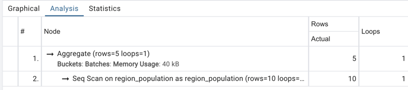

# 12 week

## 실습 1
### 지역별 성별 분포
```sql
-- 지역 이름, 성별 및 인구를 포함하는 테이블 생성
CREATE TABLE Region_Population (
    Region_Name VARCHAR(255),
    Gender VARCHAR(10),
    Population INT,
    PRIMARY KEY (Region_Name, Gender)
);

-- 데이터 삽입
INSERT INTO Region_Population (Region_Name, Gender, Population) VALUES
('서울', '남성', 5000000),
('서울', '여성', 5200000),
('부산', '남성', 2500000),
('부산', '여성', 2600000),
('대구', '남성', 2000000),
('대구', '여성', 2100000),
('인천', '남성', 2300000),
('인천', '여성', 2400000),
('광주', '남성', 1500000),
('광주', '여성', 1600000);

select Region_Name, sum(men_pop), sum(wom_pop)
from (select Region_Name, Population as men_pop, null as wom_pop
	 from Region_Population
	 where Gender = '남성'
	 UNION
	 select Region_Name, null as men_pop, Population as wom_pop 
	 from Region_Population
	 where Gender = '여성') as tmp
group by Region_name
```
### 결과


### 집계조건 사용시
````sql
select Region_Name,
	SUM(CASE WHEN gender='여성' THEN population ELSE 0 END) as pop_wom,
	SUM(CASE WHEN gender='남성' THEN population ELSE 0 END) as pop_wom
from Region_Population
group by Region_name
````



## 실습 2
### 알파벳 첫 문자마다 몇명의 사람이 존재하는가
```sql
-- 사용자 테이블 생성
CREATE TABLE Users (
                       Name VARCHAR(255),
                       Age INT,
                       Weight FLOAT,
                       Height FLOAT
);


-- 사용자 테이블에 데이터 추가
INSERT INTO Users (Name, Age, Weight, Height) VALUES
                                                  ('John Smith', 30, 70.5, 175.2),
                                                  ('Emily Davis', 25, 55.0, 162.5),
                                                  ('Michael Johnson', 40, 80.2, 180.0),
                                                  ('Sarah Brown', 28, 65.3, 168.9),
                                                  ('David Miller', 35, 75.0, 170.5),
                                                  ('Jessica Lee', 45, 68.7, 167.3),
                                                  ('Daniel Wilson', 22, 70.8, 181.6),
                                                  ('Olivia Clark', 31, 58.5, 159.8),
                                                  ('James Anderson', 37, 82.4, 178.2),
                                                  ('Sophia Martinez', 29, 63.2, 166.0);


select Substring(name,1,1) as label,
count(*)
from users
group by substring(name,1,1)
order by label;

```

### 결과


