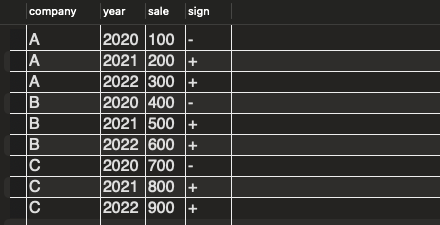
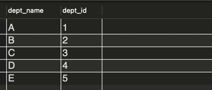
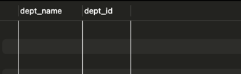

# 실습 1. SQL에서의 반복

## DDL
```sql
-- 테이블 생성
CREATE TABLE SALES (
    company VARCHAR(20),
    year INT,
    sale INT,
    sign VARCHAR(1)
);

-- 테이블 생성2
CREATE TABLE SALES2 (
    company VARCHAR(20),
    year INT,
    sale INT
);
```

## DML
```sql
-- 더미데이터 생성
INSERT INTO SALES2 (company, year, sale) VALUES
('A', 2020, 100),
('A', 2021, 200),
('A', 2022, 300),
('B', 2020, 400),
('B', 2021, 500),
('B', 2022, 600),
('C', 2020, 700),
('C', 2021, 800),
('C', 2022, 900);
```

## 반복문 (CASE + Window Function)
```sql
-- 175p
insert into SALES
select company, year, sale, 
    CASE SIGN(sale - MAX(sale) OVER (
        PARTITION BY company
        ORDER BY year
        ROWS BETWEEN 1 PRECEDING AND 1 PRECEDING)
    ) 
    WHEN 1 THEN '+' WHEN 0 THEN '=' ELSE '-' END
from SALES2;
```

## 결과


## 실행계획
```mysql
-> Insert into SALES
    -> Window multi-pass aggregate with buffering: max(sales2.sale) OVER (PARTITION BY sales2.company ORDER BY sales2.`year` ROWS BETWEEN 1 PRECEDING AND 1 PRECEDING)   (cost=0 rows=9)
        -> Sort: sales2.company, sales2.`year`  (cost=1.15 rows=9)
            -> Table scan on SALES2  (cost=1.15 rows=9)
```
- PARTITION BY company로 분할하여, ROWS BETWEEN 1 PRECEDING AND 1 PRECEDING로 이전 행을 참조한다.
- Where 구가 없기 때문에 테이블 풀스캔을 수행한다.

# 실습 2. 결합

## DDL
```sql
-- 테이블 생성
CREATE TABLE EMPLOYEE (
    emp_id INT,
    emp_name VARCHAR(20),
    dept_id INT
);

CREATE TABLE DEPARTMENT (
    dept_id INT,
    dept_name VARCHAR(20)
);
```

## DML
```mysql
-- 더미데이터 생성
INSERT INTO EMPLOYEE (emp_id, emp_name, dept_id) VALUES
(1, 'A', 1),
(2, 'B', 1),
(3, 'C', 2),
(4, 'D', 2),
(5, 'E', 3),
(6, 'F', 3),
(7, 'G', 4),
(8, 'H', 4),
(9, 'I', 5),
(10, 'J', 5);

INSERT INTO DEPARTMENT (dept_id, dept_name) VALUES
(1, 'A'),
(2, 'B'),
(3, 'C'),
(4, 'D'),
(5, 'E');
```

## EXISTS vs NOT EXISTS
```mysql
-- EXISTS
select dept_name, dept_id
from DEPARTMENT D
where exists (
    select *
    from EMPLOYEE E
    where D.dept_id = E.dept_id
);

-- NOT EXISTS
select dept_name, dept_id
from DEPARTMENT D
where not exists (
    select *
    from EMPLOYEE E
    where D.dept_id = E.dept_id
);
```
## 결과
#### EXISTS

#### NOT EXISTS


## 실행계획
#### EXISTS
```mysql
-> Nested loop inner join  (cost=6.25 rows=50)
    -> Filter: (d.dept_id is not null)  (cost=0.75 rows=5)
        -> Table scan on D  (cost=0.75 rows=5)
    -> Single-row index lookup on <subquery2> using <auto_distinct_key> (dept_id=d.dept_id)  (cost=2.31..2.31 rows=1)
        -> Materialize with deduplication  (cost=2.25..2.25 rows=10)
            -> Filter: (e.dept_id is not null)  (cost=1.25 rows=10)
                -> Table scan on E  (cost=1.25 rows=10)
```
#### NOT EXISTS
```mysql
-> Nested loop inner join  (cost=6.25 rows=50)
    -> Filter: (d.dept_id is not null)  (cost=0.75 rows=5)
        -> Table scan on D  (cost=0.75 rows=5)
    -> Single-row index lookup on <subquery2> using <auto_distinct_key> (dept_id=d.dept_id)  (cost=2.31..2.31 rows=1)
        -> Materialize with deduplication  (cost=2.25..2.25 rows=10)
            -> Filter: (e.dept_id is not null)  (cost=1.25 rows=10)
                -> Table scan on E  (cost=1.25 rows=10)
```
- EXISTS와 NOT EXISTS 모두 Nested loop inner join으로 수행된다.
- 책에서는 NESTED LOOP가 아닌 변형된 형태로 실행되는 것을 설명하고 있지만, MySQL에서는 NESTED LOOP로 수행된다.

