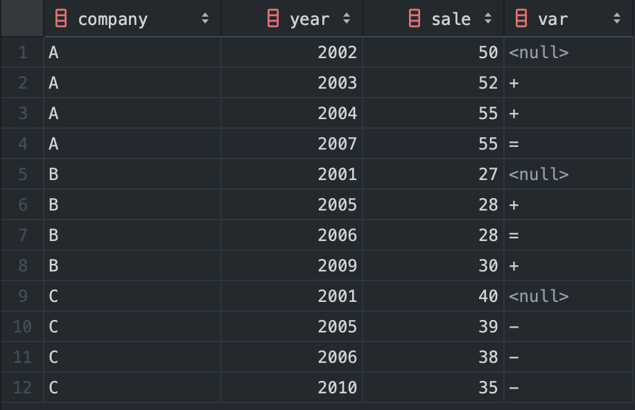
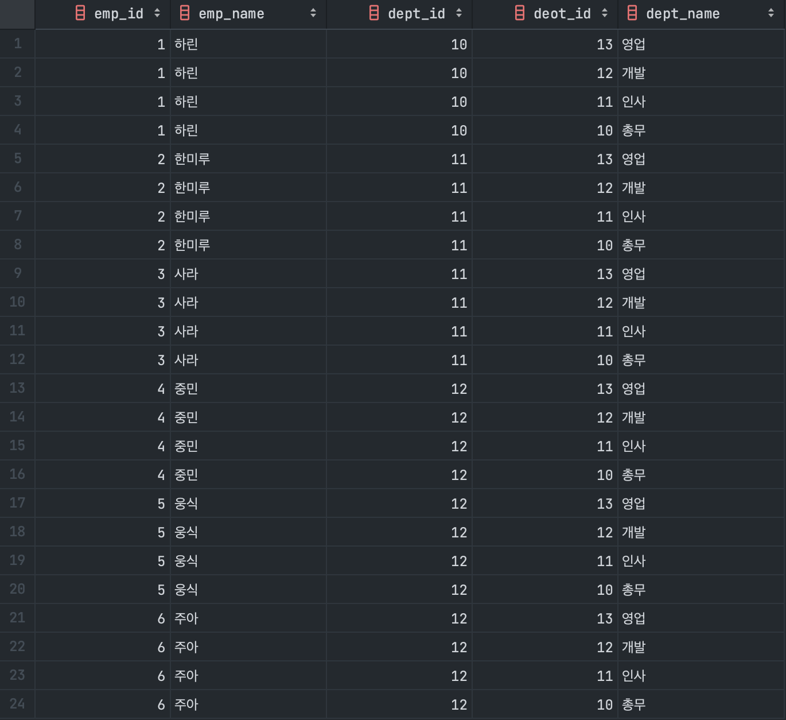
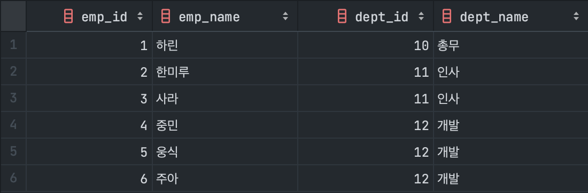
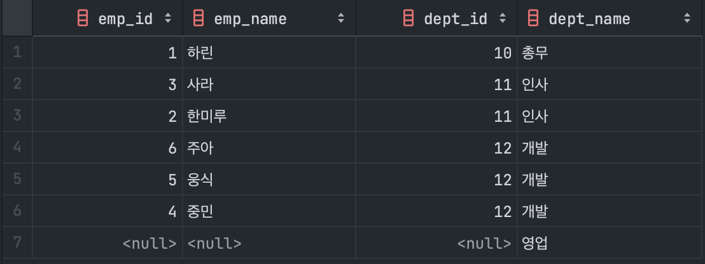
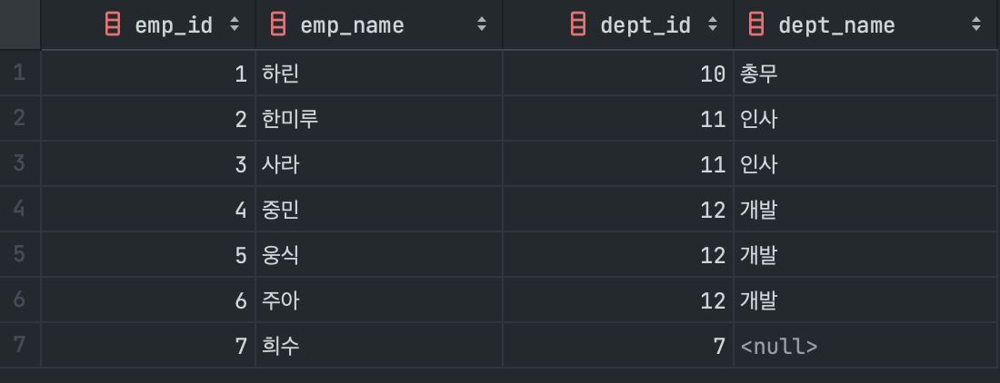

## 반복
### CASE 식과 윈도우 함수
```sql
INSERT INTO  Sales2
SELECT company,
       year,
       sale,
       CASE SIGN(sale - MAX(sale) OVER (PARTITION BY company
           ORDER BY year
           ROWS BETWEEN 1 PRECEDING AND 1 PRECEDING)) /* 현재 레코드에서 1개 이전부터 1개 이전까지*/
WHEN 0 THEN '='
WHEN 1 THEN '+'
WHEN -1 THEN '-'
ELSE NULL END AS var
FROM Sales;
```

### 윈도우 함수로 직전 회사명과 직전 매상 검색
```sql 
SELECT company,
       year,
       sale,
       MAX(company) OVER (PARTITION BY company ORDER BY year
           ROWS BETWEEN 1 PRECEDING AND 1 PRECEDING) AS pre_company,
       MAX(sale) OVER (PARTITION BY company ORDER BY year
           ROWS BETWEEN 1 PRECEDING AND 1 PRECEDING) AS pre_sale
FROM Sales;
```


## 결합
### 크로스 결합
```sql
SELECT *
FROM Employees CROSS JOIN Department;
```

### 내부 결합
```sql
SELECT E.emp_id, E.emp_name, E.dept_id, D.dept_name
FROM Employees E INNER JOIN Department D
ON E.dept_id = D.deot_id;
```

### 왼쪽 외부 결합
```sql
SELECT E.emp_id, E.emp_name, E.dept_id, D.dept_name
FROM Department D LEFT OUTER JOIN Employees E
ON E.dept_id = D.deot_id;
```


### 오른쪽 외부 결합
```sql
SELECT E.emp_id, E.emp_name, E.dept_id, D.dept_name
FROM Department D RIGHT OUTER JOIN Employees E
ON E.dept_id = D.deot_id;
```