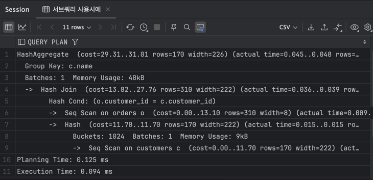

## 13week

### 실습 1 : 인덱스 사용
```sql
CREATE TABLE books (
    book_id SERIAL PRIMARY KEY,
    title VARCHAR(255) NOT NULL,
    author VARCHAR(100) NOT NULL,
    publication_year INTEGER
);

INSERT INTO books (title, author, publication_year) VALUES
('죽은 시인의 사회', '노먼 그린', 1989),
('그리고 삶은 계속된다', '김영하', 2015),
('Harry Potter와 마법사의 돌', 'J.K. 롤링', 1997),
('배려', '신유숙', 2012),
('반지의 제왕', 'J.R.R. 톨킨', 1954),
('채식주의자', '한강', 2015),
('언어의 온도', '이기주', 2011),
('김수영', '나오코 요코야마', 2015),
('날씨가 좋으면 찾아가겠어요', '이도우', 2016),
('죄와 벌', '톨스토이', 1866),
('소년이 온다', '한강', 2010),
('당신이 옳다', '정혜신', 2014),
('어린왕자', '생텍쥐페리', 1943),
('데미안', '헤르만 헤세', 1919),
('폭풍의 언덕', '에밀리 브론테', 1847),
('노인과 바다', '어니스트 헤밍웨이', 1952),
('어른의 양지', '작자 미상', 1954),
('별을 쫓는 아이', '장하준', 2017),
('열두 발자국', '정재승', 2014),
('토지', '박경리', 1969),
('스타워즈', '조지 루카스', 1977),
('브래브 뉴 월드', '올더스 헉슬리', 1932),
('백년의 고독', '가브리엘 가르시아 마르케스', 1967),
('미드나잇 선', '조지 올웰', 1939),
('어둠의 인도자', '페드로 칼데론 데 라 바르카', 1983),
('트와일라잇', '스테파니 메이어', 2005),
('오리엔트 특급 살인', '아가사 크리스티', 1934),
('더 브레이브', '데비드 미첼', 1997),
('성경', '작자 미상', 0),
('어떻게 월급루팡은 체포됐는가', '마우로 팔라초', 2017),
('메타몽', '프란츠 카프카', 1915),
('파리의 아폴론', '쇼토 오오츠키', 2017),
('프랑켄슈타인', '메리 셸리', 1818),
('사랑의 기술', '에릭 프롬', 1956),
('귀여운 여우', '알렉산드르 그린', 2016),
('안나 카레니나', '레프 톨스토이', 1877),
('오쿠다 히데오의 트릭', '히가시노 게이고', 1996),
('벌새', '한강', 2017),
('하울의 움직이는 성', '다이애나 윈 존스', 1986),
('사랑한다는 행복', '엠마 클리안', 2014),
('태백산맥', '조정래', 1995),
('이방인', '알베르 카뮈', 1942),
('반짝반짝 작은별', '작자 미상', 1806),
('화분', '정유정', 2015),
('마르크스의 검', '루이스 캐럴', 1871),
('언어의 정원', '강희선', 2017),
('모두의 레시피', '유리 앤헌센', 2016),
('악의', '마이크 데블린', 2012),
('질문이 답이다', '스티븐 리빗', 2012),
('캣츠', 'T.S. 엘리엇', 1939),
('우리가 사랑하는 방법', '올랜도 리고', 2014),
('나미야 잡화점의 기적', '히가시노 게이고', 2012),
('시원하고 달콤한 느낌', '조세포드', 1997),
('율리시즈', '제임스 조이스', 1922),
('언어의 온도', '이기주', 2011),
('행복한 끝맺음', '김민식', 2014),
('지금 이대로 좋아', '윤이수', 2016),
('바보', '필립 롯', 2002),
('데미안', '헤르만 헤세', 1919),
('사랑', '허지웅', 2014),
('완득이', '권리네 달', 2016),
('밤', '엘리 위저', 2020);

CREATE INDEX title_index ON books (title);
EXPLAIN ANALYZE SELECT * FROM books WHERE title = '1984';

DROP INDEX title_index;
EXPLAIN ANALYZE SELECT * FROM books WHERE title = '1984';

```

인덱스 사용시 시간  


인덱스 사용하지 않을 경우 시간   


=> 더욱 많은 데이터가 있어야 더욱 적합할듯


###  실습2
```sql
CREATE TABLE orders
(
    order_id     SERIAL PRIMARY KEY,
    customer_id  INTEGER,
    product_name VARCHAR(100),
    quantity     INTEGER,
    order_date   DATE,
    FOREIGN KEY (customer_id) REFERENCES customers (customer_id)
);

CREATE TABLE customers
(
    customer_id SERIAL PRIMARY KEY,
    name        VARCHAR(100) NOT NULL,
    age         INTEGER,
    city        VARCHAR(100)
);

-- customers 테이블에 데이터 삽입
INSERT INTO customers (name, age, city)
VALUES ('홍길동', 30, '서울'),
       ('김철수', 25, '부산'),
       ('이영희', 35, '대구');

-- orders 테이블에 데이터 삽입
INSERT INTO orders (customer_id, product_name, quantity, order_date)
VALUES (1, '컴퓨터', 2, '2024-04-15'),
       (1, '키보드', 1, '2024-04-16'),
       (2, '노트북', 1, '2024-04-16'),
       (3, '스마트폰', 3, '2024-04-17'),
       (3, '테블릿', 2, '2024-04-18');


-- 서브쿼리 사용시에
EXPLAIN
ANALYZE
SELECT c.name AS customer_name, SUM(o.quantity) AS total_quantity
FROM customers c
         JOIN orders o ON c.customer_id = o.customer_id
GROUP BY c.name;


-- 윈도우 함수 사용시에
EXPLAIN
ANALYZE
SELECT DISTINCT c.name AS       customer_name,
                SUM(o.quantity) OVER (PARTITION BY c.customer_id) AS total_quantity
FROM customers c
         JOIN orders o ON c.customer_id = o.customer_id;

```
서브쿼리 사용시  (스캔을 두번 한다)


윈도우 함수 사용시  (스캔을 한번만 한다)


### 다음에 확인해볼 문제 
=> 인덱스를 걸떄 더 효율적이려면 얼마만큼의 데이터가 있어야 할까?

